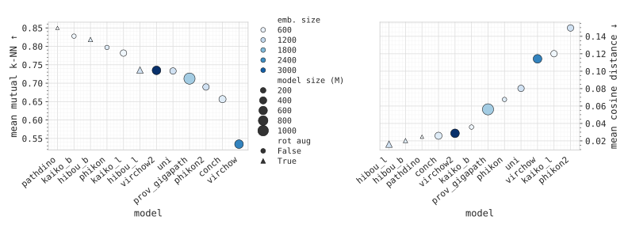

# Are the Latent Representations of Foundation Models for Pathology Invarient to Rotation?

Code for the MIDL 2025 Short Paper Submission.

## Requirements

## Extracting features

## Measuring mutual $k$-NN 

## Measuring cosine distance

