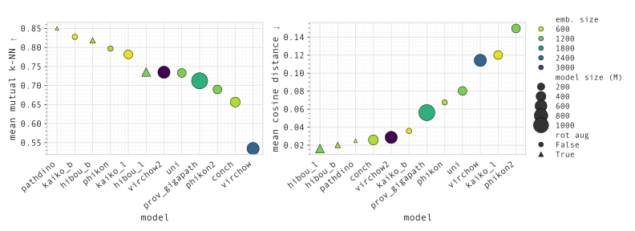

# Are the Latent Representations of Foundation Models for Pathology Invarient to Rotation?



Code for the MIDL 2025 Short Paper Submission.

## Requirements
Developed on 

`python = 3.11` `PyTorch = 2.1.0`

Clone the repository locally
```bash
git clone https://github.com/MatousE/rot-invariance-analysis.git
cd rot-invariance-analysis
```
And install the remaining requirements with
```bash
pip install -r requirements.txt
```
## Extracting embeddings
To extract the features of these models for a dataset under different rotations one must first define
a YAML file with the parameters of the experiment. An example is shown at `args/get_rot_embeddings.yaml`.

To see all supported models run
```bash
python -c 'from utils import SUPPORTED_MODELS; print(SUPPORTED_MODELS)'
```

To run the experiment you simply run the following code

```bash
python get_rot_embeddings.py --yaml /path/to/yaml/file.yaml
```
The resulting features will be stored as a single .pth file

## Measuring mutual $k$-NN 
To extract the mutual $k$-NN between the embeddings with no-rotation and with rotation one simply runs the 
following

```bash
python m_knn_distance.py --embd_path /results/embeddings.pth --k 10 --batch_size 1024
```
The results of which will be stored in a CSV file called `m_knn.csv`

## Measuring cosine distance
To extract the cosine distance between the embeddings with no-rotation and with rotation one simply runs

```bash
python cosine_distance.py --embd_path /results/embeddings.pth
```
